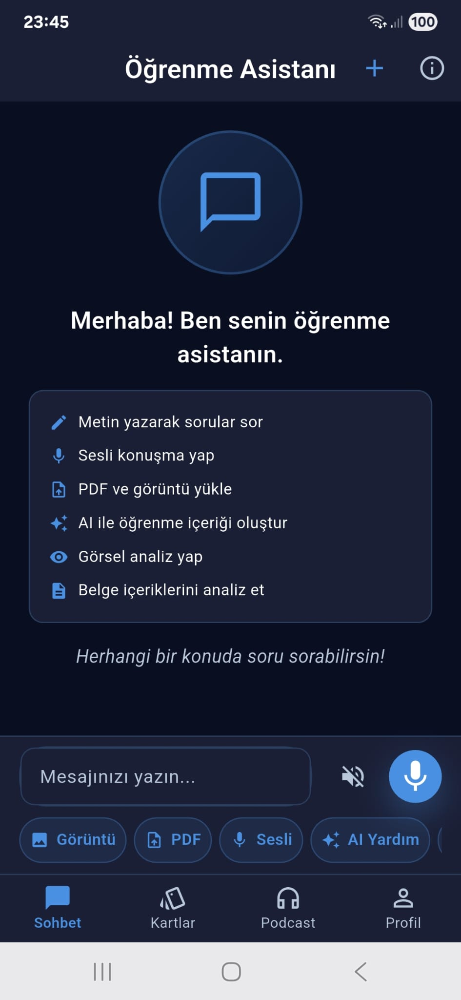
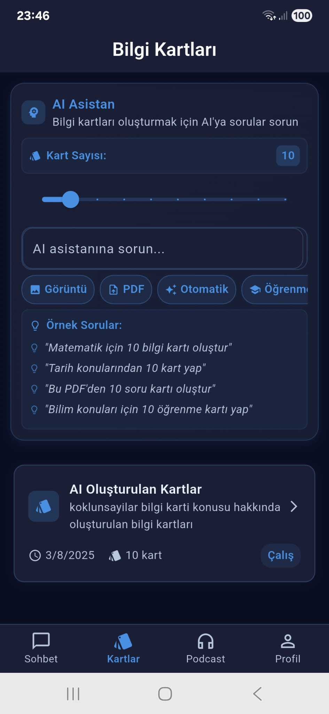
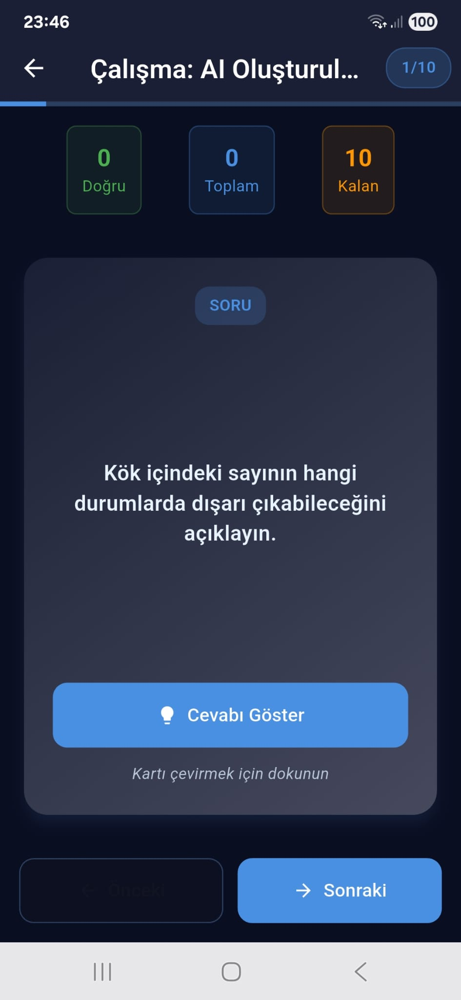
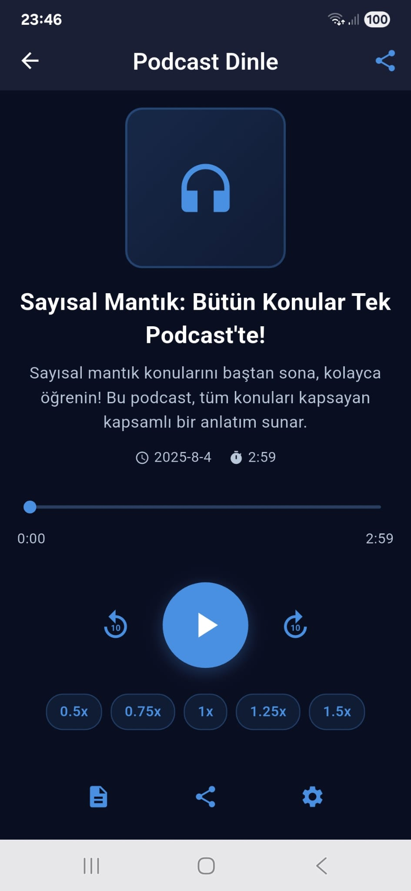

# 🎓 EduVoice AI - Sesli Etkileşimli Kişisel Eğitim Asistanı

<div align="center">
  
  <br>
  <h3>Google Gemini 2.0 Flash Destekli Akıllı Öğrenme Platformu</h3>
  <p>Yapay zeka teknolojisi ile güçlendirilmiş, sesli etkileşimli eğitim asistanı</p>
  
  [](https://flutter.dev/)
  [](https://firebase.google.com/)
  [](https://ai.google.dev/)
  [](LICENSE)
</div>

---

## 📱 Ekran Görüntüleri

### 💬 Sohbet Ekranı

*AI asistanı ile sesli etkileşim ve metin tabanlı sohbet*

### 🎴 Flashcard Sistemi

*Akıllı öğrenme kartları oluşturma ve yönetimi*

### 📚 Flashcard Kullanımı

*Etkileşimli flashcard çalışma deneyimi*

### 🎧 Podcast Oluşturma

*Eğitimsel sesli içerik oluşturma ve yönetimi*

### 🎵 Podcast Dinleme

*Sesli içerikleri dinleme ve kontrol etme*

---

## 📋 İçindekiler

- [Proje Hakkında](#-proje-hakkında)
- [Özellikler](#-özellikler)
- [Teknolojiler](#-teknolojiler)
- [Kurulum](#-kurulum)
- [Kullanım](#-kullanım)
- [API Konfigürasyonu](#-api-konfigürasyonu)
- [Mimari](#-mimari)
- [Katkıda Bulunma](#-katkıda-bulunma)
- [Lisans](#-lisans)

---

## 🎯 Proje Hakkında

**EduVoice AI**, öğrenme sürecini kişiselleştirilmiş ve etkileşimli hale getiren, yapay zeka destekli bir mobil eğitim uygulamasıdır. Google Gemini 2.0 Flash teknolojisi ile güçlendirilmiş bu platform, öğrencilere, öğretmenlere ve profesyonellere benzersiz bir öğrenme deneyimi sunar.

### 🌟 Temel Değerler

- **Kişiselleştirilmiş Öğrenme**: Her kullanıcının seviyesine uygun içerik
- **Sesli Etkileşim**: Doğal konuşma ile öğrenme
- **Multimodal Analiz**: PDF, görsel ve metin işleme
- **Akıllı İçerik Üretimi**: Otomatik flashcard ve podcast oluşturma

---

## ✨ Özellikler

### 🗣️ Sesli Etkileşim
- **Gerçek zamanlı konuşma tanıma** (Speech-to-Text)
- **Doğal ses sentezi** (Text-to-Speech)
- **Çoklu dil desteği** (Türkçe odaklı)
- **Gürültü filtreleme** ve ses optimizasyonu

### 🤖 AI Destekli Öğrenme
- **Gemini 2.0 Flash** entegrasyonu
- **Eğitimsel sistem prompt** ile optimize edilmiş yanıtlar
- **Bağlam farkındalığı** ve konuşma geçmişi
- **Kişiselleştirilmiş öğrenme** deneyimi

### 📚 Öğrenme Modülleri
- **Flashcard Sistemi**: Otomatik öğrenme kartları oluşturma
- **Podcast Üretimi**: Eğitimsel sesli içerik oluşturma
- **Belge Analizi**: PDF ve görsel işleme
- **Akıllı Özetleme**: Karmaşık içerikleri basitleştirme

### 📱 Mobil Optimizasyon
- **Cross-platform** destek (Android/iOS)
- **Responsive tasarım** ve modern UI/UX
- **Offline çalışma** imkanı
- **Performans optimizasyonu**

---

## 🛠️ Teknolojiler

### Frontend
- **Flutter 3.8+** - Cross-platform mobil geliştirme
- **Provider** - State management
- **Material Design** - Modern UI/UX

### Backend & AI
- **Firebase** - Backend as a Service
  - Authentication
  - Cloud Firestore
  - Storage
- **Google Gemini 2.0 Flash** - AI model
- **Google TTS** - Text-to-Speech

### Ses İşleme
- **Flutter TTS** - Temel ses sentezi
- **Speech Recognition** - Konuşma tanıma
- **Just Audio** - Ses dosyası işleme

### Dosya İşleme
- **File Picker** - Dosya seçimi
- **Path Provider** - Dosya yönetimi
- **HTTP** - API iletişimi

---

## 🚀 Kurulum

### Gereksinimler
- Flutter SDK 3.8.0+
- Dart 3.0+
- Android Studio / VS Code
- Git

### Adım 1: Projeyi Klonlayın
```bash
git clone https://github.com/your-username/eduvoice-ai.git
cd eduvoice-ai
```

### Adım 2: Bağımlılıkları Yükleyin
```bash
flutter pub get
```

### Adım 3: Environment Variables
`.env` dosyasını oluşturun ve API key'lerinizi ekleyin:

```env
# Google TTS API Configuration
GOOGLE_TTS_API_KEY=your_google_tts_api_key

# Gemini API Configuration
GEMINI_API_KEY=your_gemini_api_key

# Firebase Configuration
FIREBASE_PROJECT_ID=your_firebase_project_id
FIREBASE_API_KEY=your_firebase_api_key
FIREBASE_APP_ID=your_firebase_app_id
FIREBASE_SENDER_ID=your_firebase_sender_id
FIREBASE_STORAGE_BUCKET=your_firebase_storage_bucket
```

### Adım 4: Firebase Kurulumu
1. Firebase Console'da yeni proje oluşturun
2. Android/iOS uygulaması ekleyin
3. `google-services.json` dosyasını `android/app/` klasörüne ekleyin
4. iOS için `GoogleService-Info.plist` dosyasını `ios/Runner/` klasörüne ekleyin

### Adım 5: Uygulamayı Çalıştırın
```bash
flutter run
```

---

## 📖 Kullanım

### 🎯 Ana Özellikler

#### 1. Sesli Sohbet
- Mikrofon butonuna basın
- Sorunuzu sesli olarak sorun
- AI asistanınız anında yanıt verecek

#### 2. Belge Analizi
- PDF veya görsel dosyanızı seçin
- AI asistanı içeriği analiz edecek
- Sorularınızı sorun ve detaylı yanıtlar alın

#### 3. Flashcard Oluşturma
- Herhangi bir konu hakkında flashcard oluşturun
- AI otomatik olarak öğrenme kartları hazırlayacak
- Çalışın ve ilerlemenizi takip edin

#### 4. Podcast Dinleme
- Konular hakkında sesli içerikler oluşturun
- Yolda, spor yaparken veya dinlenirken dinleyin

### 🎨 Arayüz Özellikleri

#### Ana Ekran
- **Sohbet**: AI ile etkileşim
- **Kartlar**: Flashcard yönetimi
- **Podcast**: Sesli içerik oluşturma
- **Profil**: Kullanıcı ayarları

#### Özelleştirme Seçenekleri
- **Ses Tonu**: Profesyonel, Arkadaşça, Seyirciye Uygun
- **İçerik Uzunluğu**: Özet, Detaylı, Kapsamlı
- **Dil Seçimi**: Türkçe odaklı

---

## 🏗️ Mimari

### Katmanlı Mimari
```
lib/
├── main.dart                 # Uygulama giriş noktası
├── config/                   # Konfigürasyon dosyaları
├── models/                   # Veri modelleri
├── providers/                # State management
├── screens/                  # UI ekranları
├── services/                 # İş mantığı servisleri
├── utils/                    # Yardımcı fonksiyonlar
└── widgets/                  # Yeniden kullanılabilir bileşenler
```

### Teknoloji Stack
- **Presentation Layer**: Flutter Widgets
- **Business Logic**: Provider Pattern
- **Data Layer**: Firebase + Local Storage
- **AI Integration**: Google Gemini 2.0 Flash

### Güvenlik
- **API Key Management**: Environment variables
- **Data Encryption**: Firebase security rules
- **User Privacy**: Local data processing
- **Secure Communication**: HTTPS endpoints

---

## 📊 Performans

### Optimizasyonlar
- **Context Management**: Akıllı mesaj geçmişi yönetimi
- **Response Caching**: Tekrarlanan sorgular için önbellek
- **Memory Management**: Otomatik bellek temizleme
- **Network Optimization**: Verimli API çağrıları

### Metrikler
- **Yanıt Süresi**: 2-3 saniye
- **Bellek Kullanımı**: < 100MB
- **Uygulama Boyutu**: < 50MB
- **Battery Usage**: Optimize edilmiş

---

## 🤝 Katkıda Bulunma

### Geliştirme Ortamı Kurulumu
1. Projeyi fork edin
2. Feature branch oluşturun: `git checkout -b feature/amazing-feature`
3. Değişikliklerinizi commit edin: `git commit -m 'Add amazing feature'`
4. Branch'inizi push edin: `git push origin feature/amazing-feature`
5. Pull Request oluşturun

### Kod Standartları
- **Dart/Flutter** best practices
- **Clean Architecture** prensipleri
- **SOLID** design patterns
- **Comprehensive** error handling

### Test Stratejisi
- **Unit Tests**: Business logic
- **Widget Tests**: UI components
- **Integration Tests**: End-to-end scenarios

---

## 📄 Lisans

Bu proje MIT lisansı altında lisanslanmıştır. Detaylar için [LICENSE](LICENSE) dosyasına bakın.

---
